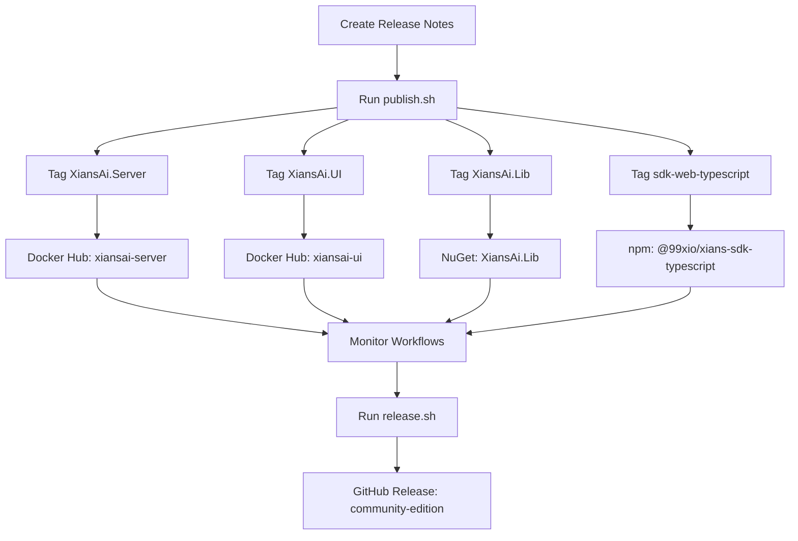

# Release Guide for XiansAi Platform Community Edition

This guide covers the complete release process for maintainers of the XiansAi Platform Community Edition.

## 📋 Overview

Our release process includes:

- Multi-repository artifact publishing
- Semantic versioning across all components
- Automated release scripts and monitoring
- GitHub releases with detailed notes
- Docker image management
- Changelog maintenance
- Community communication

## 🚀 Complete Release Workflow

### Step-by-Step Process

#### 1. **Prepare Release Notes**

```bash
# Create a new release branch
VERSION=v2.1.0
```

```bash
# Create release notes template
./scripts/create-release-notes.sh $VERSION

# Edit the generated file: ./releases/$VERSION.md
# Add actual changes, features, and migration guides
```

#### 2. **Publish All Artifacts**

```bash
# Test the publishing process
./scripts/publish.sh $VERSION --dry-run

# Publish artifacts across all repositories
./scripts/publish.sh $VERSION
```

#### 3. **Monitor Workflows** (Recommended)

```bash
# Monitor GitHub Actions workflows
./scripts/workflow-monitor.sh $VERSION

# Or monitor with custom timeout
./scripts/workflow-monitor.sh $VERSION --timeout 45
```

#### 4. **Create Community Edition Release**

```bash
# After all artifacts are published successfully
./release.sh $VERSION
```

### Quick Release Process

For experienced maintainers:

```bash
# 1. Create and edit release notes
./scripts/create-release-notes.sh $VERSION
# Edit ./releases/$VERSION.md

# 2. Publish all artifacts and monitor
./scripts/publish.sh $VERSION && ./scripts/workflow-monitor.sh $VERSION

# 3. Create community release
./release.sh $VERSION
```

### For Pre-releases

```bash
# Beta release
./scripts/create-release-notes.sh $VERSION-beta.1
./scripts/publish.sh $VERSION-beta.1
./scripts/workflow-monitor.sh $VERSION-beta.1
./release.sh $VERSION-beta.1 --prerelease

# Release candidate
./scripts/publish.sh $VERSION-rc.1
./release.sh $VERSION-rc.1 --prerelease
```

## 📅 Release Schedule

### Regular Releases

- **Major releases**: Every 6-12 months
- **Minor releases**: Every 1-2 months
- **Patch releases**: As needed for critical fixes

### Release Calendar

- **Week 1**: Feature freeze, testing
- **Week 2**: Release candidate, final testing
- **Week 3**: Release preparation, documentation
- **Week 4**: Release publication, communication

## 🏷️ Versioning Strategy

We follow [Semantic Versioning](https://semver.org/) (SemVer):

### Version Format: `v{MAJOR}.{MINOR}.{PATCH}[-{PRERELEASE}]`

- **MAJOR**: Breaking changes, incompatible API changes
- **MINOR**: New features, backward-compatible
- **PATCH**: Bug fixes, backward-compatible
- **PRERELEASE**: Alpha, beta, rc versions

### Examples

- `v2.1.0` - Minor release with new features
- `v2.1.1` - Patch release with bug fixes
- `v3.0.0` - Major release with breaking changes
- `v2.1.0-beta.1` - Beta pre-release
- `v2.1.0-rc.1` - Release candidate

## 🏗️ Repository Architecture

The XiansAi Platform consists of multiple repositories, each with its own artifacts:

### Repository Structure

| Repository | Artifact Type | Registry | Image/Package Name |
|------------|---------------|----------|-------------------|
| **XiansAi.Server** | Docker Image | Docker Hub | `99xio/xiansai-server` |
| **XiansAi.UI** | Docker Image | Docker Hub | `99xio/xiansai-ui` |
| **XiansAi.Lib** | NuGet Package | NuGet.org | `XiansAi.Lib` |
| **sdk-web-typescript** | npm Package | npmjs.com | `@99xio/xians-sdk-typescript` |
| **community-edition** | GitHub Release | GitHub | Community distribution |

### Publishing Flow



## 📝 Release Notes Guidelines

### Structure

```markdown
# 🚀 New Features
- List new features and enhancements

## 🔧 Improvements
- Performance and usability improvements

## 🐛 Bug Fixes
- Fixed issues and resolved bugs

## ⚠️ Breaking Changes
- API changes requiring user action

## 📋 Migration Guide
- Step-by-step upgrade instructions

## 🔒 Security Updates
- Security patches and improvements

## 📚 Documentation
- Documentation updates and additions
```

### Writing Guidelines

1. **User-focused language**: Write for end users, not developers
2. **Clear descriptions**: Explain the impact and benefits
3. **Migration instructions**: Provide clear upgrade paths
4. **Code examples**: Include relevant code snippets
5. **Links**: Reference related PRs, issues, and docs

## 🔧 Release Scripts

### Main Scripts

#### `./scripts/publish.sh` - Multi-Repository Publisher

**Features:**

- Tags all repositories with the same version
- Triggers GitHub Actions workflows
- Validates repository states
- Provides publishing progress tracking
- Dry-run mode for testing

**Usage:**

```bash
./scripts/publish.sh v2.1.0                    # Publish all artifacts
./scripts/publish.sh v2.1.0 --dry-run          # Test publishing
./scripts/publish.sh v2.1.0 --force            # Skip confirmations
./scripts/publish.sh v2.1.0 --skip-validation  # Skip repo validation
```

#### `./scripts/workflow-monitor.sh` - GitHub Actions Monitor

**Features:**

- Real-time workflow monitoring across repositories
- Configurable timeout and polling intervals
- Workflow failure detection and logging
- Integration with GitHub CLI

**Usage:**

```bash
./scripts/workflow-monitor.sh v2.1.0           # Monitor workflows
./scripts/workflow-monitor.sh v2.1.0 --timeout 45  # Custom timeout
./scripts/workflow-monitor.sh v2.1.0 --show-logs   # Show failure logs
```

#### `./release.sh` - Community Edition Release

**Features:**

- Community edition GitHub release creation
- Changelog automation
- Release notes integration
- Git tag management

**Usage:**

```bash
./release.sh v2.1.0                    # Create stable release
./release.sh v2.1.0-beta.1 --prerelease  # Create pre-release
./release.sh v2.1.0 --draft            # Create draft release
```

#### `./scripts/create-release-notes.sh` - Release Notes Generator

**Features:**

- Template generation for release notes
- Different templates for stable vs pre-release
- Structured markdown format
- Automatic editor opening

**Usage:**

```bash
./scripts/create-release-notes.sh v2.1.0        # Create template
./scripts/create-release-notes.sh v2.1.0-beta.1 # Create beta template
```

## 🐳 Docker Image Management

### Tagging Strategy

- **Latest**: Points to the most recent stable release
- **Version tags**: Specific version (e.g., `v2.1.0`)
- **Branch tags**: Development branches (e.g., `main`, `develop`)

### Multi-Architecture Support

All Docker images support:

- **linux/amd64** - Standard x86_64 architecture
- **linux/arm64** - ARM64 architecture (Apple Silicon, ARM servers)

### Image Validation

The publish script validates Docker images by:

1. Testing docker-compose configuration
2. Attempting to start services with new version
3. Verifying health checks pass
4. Cleaning up test environment

## 🧪 Testing Before Release

### Pre-release Checklist

- [ ] All automated tests pass across repositories
- [ ] Manual testing completed for integration
- [ ] Documentation updated across all components
- [ ] Migration guide tested end-to-end
- [ ] Breaking changes documented thoroughly
- [ ] Performance benchmarks acceptable
- [ ] Security review completed
- [ ] All repository dependencies aligned

### Testing Commands

```bash
# Test individual repository publishing
./scripts/publish.sh v2.1.0 --dry-run

# Test platform startup with new version
./start-all.sh -v v2.1.0

# Test different environments
./start-all.sh -v v2.1.0 -e staging
./start-all.sh -v v2.1.0 -e production

# Test reset functionality
./reset-all.sh -f

# Test complete release process
./scripts/publish.sh v2.1.0 --dry-run
./release.sh v2.1.0 --dry-run
```

## 🤖 Automated Workflows

### GitHub Actions Integration

Each repository has automated workflows that trigger on version tags:

#### XiansAi.Server & XiansAi.UI

- **Workflow**: `dockerhub-deploy.yml`
- **Triggers**: Version tags (`v*`)
- **Actions**: Build multi-arch images, push to Docker Hub
- **Artifacts**: Docker images with semantic versioning

#### XiansAi.Lib

- **Workflow**: `nuget-publish.yml`
- **Triggers**: Version tags (`v*`)
- **Actions**: Build, test, pack, publish to NuGet
- **Artifacts**: NuGet packages

#### sdk-web-typescript

- **Workflow**: `publish-npm.yml`
- **Triggers**: Version tags (`v*`)
- **Actions**: Build, test, publish to npm
- **Artifacts**: npm packages

### Workflow Monitoring

The `workflow-monitor.sh` script provides:

- Real-time status updates
- Failure detection and reporting
- Workflow log access for debugging
- Timeout handling for long-running builds

## 📢 Communication Strategy

### Release Announcements

- **GitHub Release**: Primary announcement with full notes
- **README Updates**: Reflect latest version information
- **Documentation**: Update all version references
- **Community**: Notify users of important changes

### Breaking Changes Communication

1. **Advance Notice**: Announce in previous release
2. **Migration Guide**: Detailed upgrade instructions
3. **Deprecation Warnings**: Clear timeline for removal
4. **Support**: Help users with migration

## 🔒 Security Considerations

### Security Releases

- **Immediate fixes**: Critical security issues
- **Coordinated disclosure**: Follow responsible disclosure
- **Clear communication**: Security advisory with details
- **Rapid deployment**: Fast-track release process

### Release Security

- **Signed releases**: GPG signatures for verification
- **Checksums**: Verify file integrity
- **Secure channels**: Use HTTPS and verified sources
- **Access control**: Limit release permissions

## 📊 Release Metrics

### Tracking Success

- **Download counts**: Monitor adoption across artifacts
- **Issue reports**: Track post-release problems
- **Community feedback**: User satisfaction
- **Performance metrics**: System performance

### Post-release Review

- **What went well**: Successful aspects
- **What could improve**: Areas for enhancement
- **Lessons learned**: Process improvements
- **Action items**: Future improvements

## 🛠️ Troubleshooting

### Common Issues

**Publish script fails:**

```bash
# Check repository locations
ls -la ../XiansAi.Server ../XiansAi.UI ../XiansAi.Lib ../sdk-web-typescript

# Verify git status across repos
./scripts/publish.sh v2.1.0 --dry-run

# Skip validation if repos have issues
./scripts/publish.sh v2.1.0 --skip-validation
```

**Workflow monitoring fails:**

```bash
# Check GitHub CLI authentication
gh auth status

# Login if needed
gh auth login

# Test workflow access
gh run list --repo flowmaxer-ai/XiansAi.Server
```

**Missing release notes:**

```bash
# Create release notes
./scripts/create-release-notes.sh v2.1.0

# Edit the file before running release
```

**Docker validation fails:**

```bash
# Check Docker setup
docker --version
docker compose --version

# Test manually
./start-all.sh -v v2.1.0 --test
```

### Repository Path Issues

If repositories are not in expected locations:

1. **Update repository paths** in `scripts/publish.sh`:

   ```bash
   # Edit the REPOS_CONFIG array
   nano scripts/publish.sh
   ```

2. **Use symbolic links**:

   ```bash
   ln -s /path/to/actual/XiansAi.Server ../XiansAi.Server
   ```

3. **Skip validation** for testing:

   ```bash
   ./scripts/publish.sh v2.1.0 --skip-validation
   ```

## 📚 Additional Resources

- [Semantic Versioning](https://semver.org/)
- [Keep a Changelog](https://keepachangelog.com/)
- [GitHub CLI Documentation](https://cli.github.com/manual/)
- [Docker Compose Documentation](https://docs.docker.com/compose/)
- [Conventional Commits](https://www.conventionalcommits.org/)

---

For questions about the release process, please create an issue or reach out to the maintainer team. 