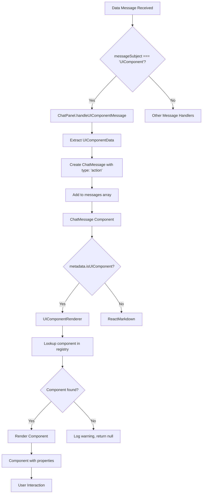

# UI Components in Chat Messages

## Overview
The chat system supports embedding interactive UI components within chat messages through a data message system. This allows agents to display custom interfaces like buttons, forms, or other interactive elements directly in the chat flow.

## Architecture

### Component Flow
UI components are delivered through the data message system and rendered inline within chat messages. The system uses a registry pattern to map component names to their implementations.

### Key Components
- **ComponentRegistry**: Central registry mapping component names to React components
- **UIComponentRenderer**: Renders the appropriate component based on registry lookup
- **ChatPanel**: Subscribes to UIComponent data messages
- **ChatMessage**: Conditionally renders UI components or standard markdown content

## Adding New UI Components

### Step 1: Create Your Component
Create a new component file in `src/components/legal/chat-components/`:

```typescript
// YourComponent.tsx
import React from 'react';
import { Box, Button } from '@mui/material';

interface YourComponentProps {
  properties: Record<string, unknown>;
}

const YourComponent: React.FC<YourComponentProps> = ({ properties }) => {
  // Extract your specific properties
  const title = properties.title as string;
  const url = properties.url as string;

  // Handle missing required properties
  if (!title || !url) {
    console.warn('[YourComponent] Missing required properties');
    return null;
  }

  const handleClick = () => {
    window.open(url, '_blank');
  };

  return (
    <Box sx={{ my: 1 }}>
      <Button variant="contained" onClick={handleClick}>
        {title}
      </Button>
    </Box>
  );
};

export default YourComponent;
```

### Step 2: Register the Component
Add your component to the registry in `ComponentRegistry.tsx`:

```typescript
// ComponentRegistry.tsx
import YourComponent from './YourComponent';

const componentRegistry: Record<string, React.FC<UIComponentProps>> = {
  ContractLink,
  YourComponent, // Add your component here
  // Add more components as needed
};
```

**That's it!** The system automatically handles the rest.

### Step 3: Test Your Component
Your component will be triggered when a data message arrives with the following structure:

```json
{
  "messageSubject": "UIComponent",
  "data": {
    "name": "YourComponent",
    "properties": {
      "title": "Open External Link",
      "url": "https://example.com"
    }
  }
}
```

## Component Processing Flow

### Message Processing Diagram



### Detailed Flow

1. **Data Message Reception**: The `CommsService` receives a data message through the WebSocket connection

2. **Message Subject Filtering**: The `DataMessageContext` publishes messages based on their `messageSubject`

3. **UIComponent Subscription**: `ChatPanel` subscribes to "UIComponent" messages and processes them

4. **Chat Message Creation**: A new `ChatMessage` is created with:
   - `type: 'action'`
   - `metadata.isUIComponent: true`
   - `metadata.uiComponentData: UIComponentData`

5. **Message Rendering**: `ChatMessageComponent` checks for UI component metadata and conditionally renders

6. **Component Registry Lookup**: `UIComponentRenderer` looks up the component by name in the registry

7. **Component Rendering**: The matched component is rendered with the provided properties

## Best Practices

### Component Design
- **Defensive Programming**: Always check for required properties and handle missing data gracefully
- **Consistent Styling**: Use Material-UI components and follow the existing design patterns
- **Error Handling**: Log warnings for missing components or invalid properties
- **Accessibility**: Ensure components are accessible with proper ARIA labels

### Properties Interface
- Use `Record<string, unknown>` for the base properties type
- Cast specific properties to their expected types
- Validate required properties before rendering

### Registry Management
- Keep the registry in one central location (`ComponentRegistry.tsx`)
- Import and register new components as they're created
- Use descriptive component names that match the data message structure

## Example Components

### ContractLink
A button component that navigates to a specific contract:

```typescript
// Data message
{
  "name": "ContractLink",
  "properties": {
    "id": "3084d6f3-2c1d-4e96-ab31-c0aa049f5d62"
  }
}
```

### Future Component Ideas
- **DocumentViewer**: Inline document preview
- **FormWidget**: Dynamic form collection
- **StatusIndicator**: Real-time status displays
- **ActionMenu**: Multi-action dropdown menus

## Troubleshooting

### Common Issues
1. **Component not rendering**: Check if it's registered in `ComponentRegistry.tsx`
2. **Properties undefined**: Verify the data message structure matches expected format
3. **TypeScript errors**: Ensure proper type casting for component-specific properties

### Debugging
- Check browser console for component warnings
- Verify data message structure in network tab
- Use React DevTools to inspect component props and state

## Security Considerations
- Always validate and sanitize properties before use
- Be cautious with URLs and external links
- Implement proper authentication checks for sensitive actions
- Consider rate limiting for component interactions