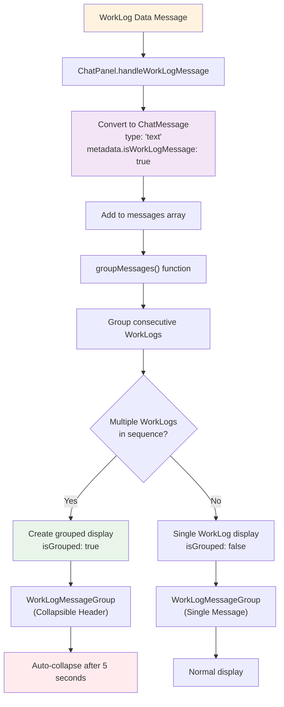

# WorkLog Messages in Chat System

## Overview
WorkLog messages provide real-time status updates and progress information from AI agents during task execution. They appear as subtle, grouped messages in the chat interface, giving users visibility into what the agent is doing without cluttering the main conversation flow.

## Architecture

### Key Components
- **DataMessageContext**: Publishes WorkLog messages from the communication service
- **ChatPanel**: Subscribes to WorkLog messages and converts them to chat messages
- **groupMessages()**: Groups consecutive WorkLog messages for better UX
- **WorkLogMessageGroup**: Specialized component for rendering WorkLog messages
- **Auto-collapse**: Automatically collapses grouped WorkLogs after 5 seconds

### Visual Design Philosophy
WorkLog messages use a distinct visual style to differentiate them from regular chat:
- **Muted colors**: Subtle gray tones to stay in the background
- **Smaller avatars**: Compact work log icons instead of agent avatars
- **Different borders**: Less rounded corners and subtle top accent
- **Grouping**: Multiple consecutive WorkLogs collapse into an expandable group
- **Auto-hide**: Groups automatically collapse to reduce visual noise

## Message Flow

### Data Message Structure
WorkLog messages arrive through the data message system with this structure:

```json
{
  "messageSubject": "WorkLog",
  "data": "Starting document analysis...",
  "message": {
    "id": "worklog-123",
    "createdAt": "2025-01-30T10:30:00Z",
    "threadId": "thread-456"
  }
}
```

### Processing Flow Diagram



## Message Grouping Logic

### Grouping Algorithm
The `groupMessages()` function processes the message array to group consecutive WorkLog messages:

```typescript
// Simplified grouping logic
for (const message of messages) {
  const isWorkLog = message.metadata?.isWorkLogMessage === true;
  const messageType = isWorkLog ? 'worklog' : 'chat';

  if (messageType !== currentType) {
    // Save previous group and start new one
    if (currentGroup.length > 0) {
      groups.push({
        type: currentType,
        messages: currentGroup,
        isGrouped: currentType === 'worklog' && currentGroup.length > 1
      });
    }
    currentGroup = [message];
    currentType = messageType;
  } else {
    // Add to current group
    currentGroup.push(message);
  }
}
```

### Grouping Rules
1. **Consecutive WorkLogs**: Only WorkLog messages that appear consecutively are grouped
2. **Interruption by Chat**: Any regular chat message breaks the WorkLog group
3. **Minimum for Grouping**: At least 2 WorkLog messages required for grouping behavior
4. **Single WorkLogs**: Display normally but with WorkLog styling

### Example Grouping Scenarios

#### Scenario 1: Multiple Consecutive WorkLogs
```
Message 1: "Hello, I'll help you with that" (chat)
Message 2: "Starting document analysis..." (worklog)
Message 3: "Processing page 1 of 5..." (worklog)
Message 4: "Extracting key terms..." (worklog)
Message 5: "Here are the results:" (chat)
```

**Result**: Messages 2-4 grouped into collapsible WorkLog group

#### Scenario 2: Single WorkLog
```
Message 1: "Hello, I'll help you with that" (chat)
Message 2: "Analyzing document..." (worklog)
Message 3: "Here are the results:" (chat)
```

**Result**: Message 2 displays as single WorkLog (no grouping)

## WorkLog Display Components

### Single WorkLog Message
For individual WorkLog messages or the first/last in a sequence:

**Visual Features:**
- Smaller avatar (28px) with work log icon
- Muted background color (`colors.surface.tertiary`)
- Subtle border with gradient accent at top
- "Work Log •" prefix in timestamp
- Reduced font size (0.8rem)

### Grouped WorkLog Messages
For multiple consecutive WorkLog messages:

**Collapsible Header:**
- Compact avatar (24px) with work log icon
- Shows count: "Work Logs (3 entries)"
- Expand/collapse icon button
- Hover effect for interactivity

**Collapsed State:**
- Shows only the header with message count
- Saves vertical space in chat
- Click to expand and view all messages

**Expanded State:**
- All WorkLog messages visible
- Individual timestamps for each message
- Automatic collapse after 5 seconds

### Auto-Collapse Behavior
```typescript
useEffect(() => {
  if (isGrouped && messages.length > 1) {
    const timer = setTimeout(() => {
      setIsExpanded(false);
    }, 5000); // Auto-collapse after 5 seconds

    return () => clearTimeout(timer);
  }
}, [isGrouped, messages.length]);
```

## Styling and Theme Integration

### Color Scheme
WorkLog messages use a dedicated color palette:

```typescript
colors: {
  worklog: {
    primary: '#6B7280',      // Icon and accent colors
    secondary: '#4B5563',    // Code text color
    background: '#F9FAFB'    // Code background
  },
  surface: {
    tertiary: '#F8FAFC'      // Message background
  },
  border: {
    secondary: '#E5E7EB'     // Border color
  }
}
```

### Typography
- **Font size**: 0.8rem (smaller than regular chat)
- **Line height**: 1.5 for readability
- **Weight**: Normal (not bold like chat messages)
- **Opacity**: 0.95 for subtle appearance

### Spacing and Layout
- **Reduced padding**: Less than regular chat bubbles
- **Compact margins**: Tighter spacing between WorkLogs
- **Left alignment**: Always aligned to the left (agent side)
- **Maximum width**: 92% of container width

## Integration Patterns

### Adding WorkLog Support to Agents
Agents can send WorkLog messages through the data message system:

```typescript
// Agent sends WorkLog update
await commsService.sendDataMessage({
  messageSubject: 'WorkLog',
  data: 'Processing document page 3 of 10...'
});
```

### WorkLog Message Content
WorkLog messages support markdown formatting:
- **Code blocks**: For technical details
- **Lists**: For step-by-step updates
- **Emphasis**: For important status updates

```markdown
### Processing Document
- ✅ Extracted text content
- ⏳ Analyzing key entities
- ⏸️ Waiting for user confirmation
```

## Best Practices

### Content Guidelines
1. **Be Concise**: Keep WorkLog messages brief and focused
2. **Use Action Verbs**: Start with what you're doing ("Analyzing...", "Processing...")
3. **Include Progress**: Show progress when possible ("3 of 10 pages")
4. **Status Indicators**: Use emojis or symbols for status (✅ ⏳ ❌)

### Frequency Considerations
- **Don't Spam**: Avoid too many rapid WorkLog messages
- **Meaningful Updates**: Only send WorkLogs for significant progress
- **Group Related Actions**: Send multiple related updates in sequence for grouping

### User Experience
- **Non-Intrusive**: WorkLogs shouldn't interrupt the conversation flow
- **Collapsible**: Long sequences should auto-collapse to save space
- **Contextual**: WorkLogs should relate to the current task

## Troubleshooting

### Common Issues

#### WorkLog Not Appearing
1. Check if `messageSubject` is exactly "WorkLog"
2. Verify DataMessageContext subscription is active
3. Ensure data payload is a string or valid content

#### Grouping Not Working
1. Confirm messages are consecutive (no chat messages in between)
2. Check that `metadata.isWorkLogMessage` is set to `true`
3. Verify at least 2 WorkLog messages exist for grouping

#### Auto-Collapse Not Working
1. Ensure `isGrouped` prop is `true`
2. Check that messages array has length > 1
3. Verify useEffect dependencies are correct

### Debugging
```typescript
// Debug WorkLog message processing
console.log('[WorkLog Debug]', {
  messageSubject: payload.messageSubject,
  isWorkLog: payload.messageSubject === 'WorkLog',
  dataType: typeof payload.data,
  messageContent: payload.data
});
```

## Future Enhancements

### Potential Features
- **Progress Bars**: Visual progress indicators for long tasks
- **Timestamps**: More detailed time information
- **Filtering**: Option to hide/show WorkLogs
- **Export**: Ability to export WorkLog history
- **Categorization**: Different WorkLog types (info, warning, error)

### Advanced Grouping
- **Time-based Grouping**: Group WorkLogs within time windows
- **Task-based Grouping**: Group by workflow or task ID
- **Smart Collapsing**: AI-driven collapse decisions based on content

## Security and Performance

### Considerations
- **Rate Limiting**: Prevent WorkLog spam from affecting performance
- **Content Sanitization**: Ensure WorkLog content is safe to render
- **Memory Management**: Auto-cleanup of old WorkLog messages
- **Bandwidth**: Efficient message compression for high-frequency updates

The WorkLog system provides essential visibility into agent operations while maintaining a clean, unobtrusive chat experience. Its grouping and auto-collapse features ensure that detailed progress information is available when needed but doesn't overwhelm the user interface.